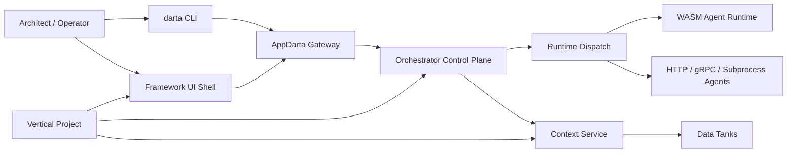

# Architecture

AppDarta separates the central control plane from business-scoped vertical implementations.

## Control Plane

Framework-owned:

- CLI
- UI shell
- gateway
- orchestration and policy engine
- model registry and codegen controls
- runtime dispatch contract
- central schemas and validation

The release stance on multi-agent behavior is intentionally narrow:

- deterministic coordination patterns first
- sequential, parallel, loop, and explicit handoff as framework semantics
- scoped handoff state instead of a global shared scratchpad
- policy and audit visibility at coordination boundaries

## Vertical Plane

Vertical-owned:

- use case and design instance specs
- business modules
- business runtime code
- business UI modules
- business data bindings

The framework remains centralized. Verticals stay business-scoped.

## Multi-Agent Position

AppDarta does not present unconstrained swarm behavior as the default release model.

For the release, the trustworthy claim is:

- orchestration belongs to the framework
- policy gates handoff and fan-out boundaries
- runtime steps remain isolated
- operator surfaces should be able to explain what happened

That is enough to support multi-step vertical workflows without locking the framework into shared-scratchpad or prompt-only delegation semantics.
