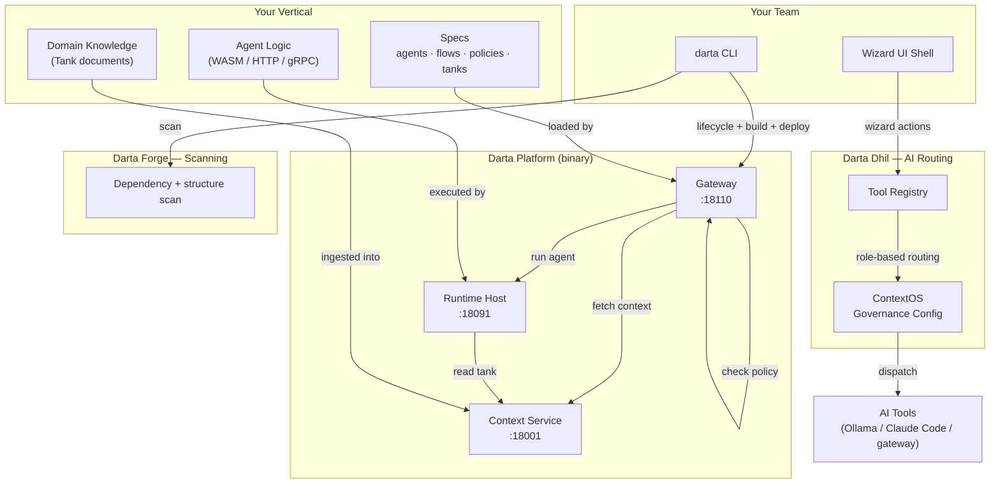
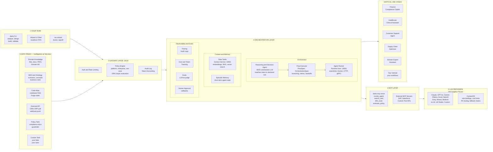
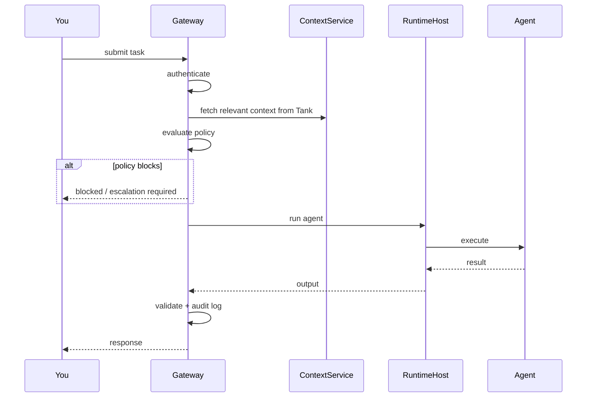
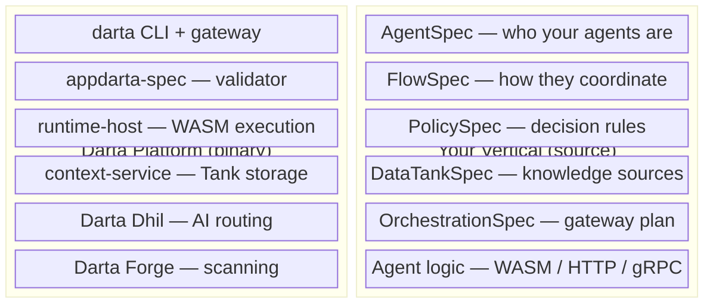
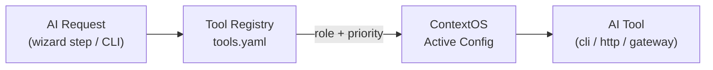
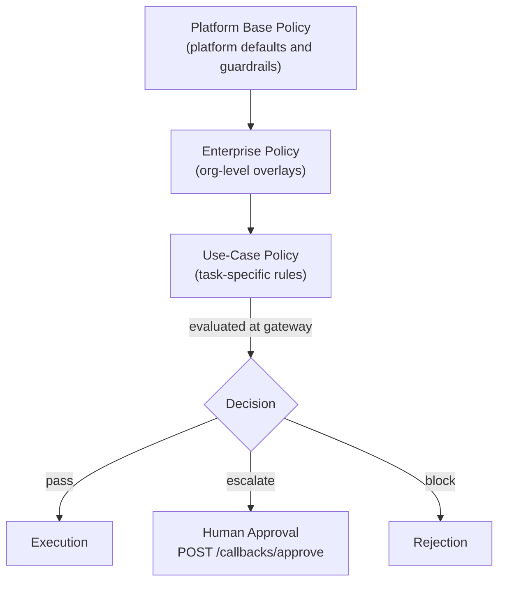
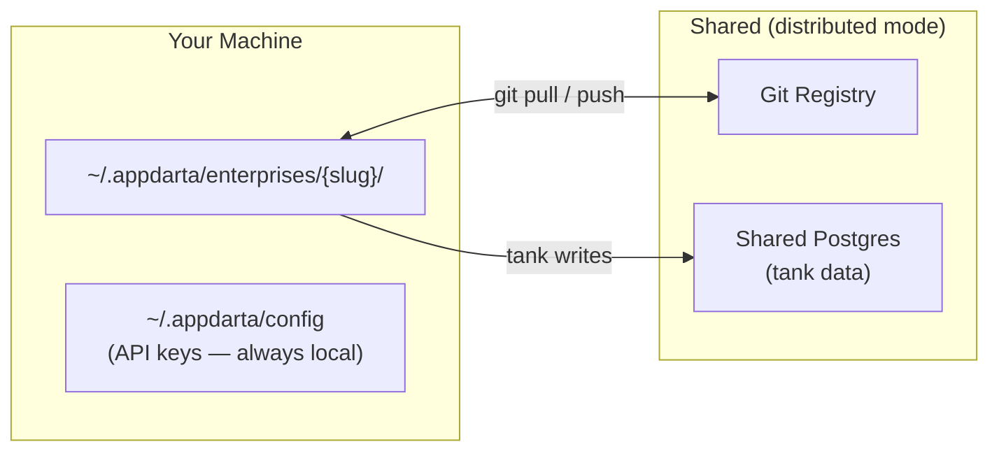
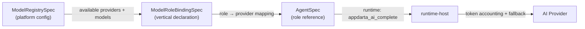

# Architecture

Darta Platform is built around a clean separation between the **control plane** — the routing, orchestration, and governance engine — and the **execution plane** — your agents, which run as independently deployable containers in any language you choose.

You configure everything through specs and the CLI. You never need to touch the platform internals.

---

## The Big Picture



---

## High-Level Architecture

*Composable. Decoupled. Scalable.*



> **Key principle:** Treat knowledge, agents, and AI providers as composable services. The Gateway orchestrates. The Reasoning Agent decides. Your agents execute. Darta delivers the vertical.

---

## The Big Picture

Every request in Darta passes through two distinct layers:

### Control Plane — Platform-managed

This is the routing, orchestration, and governance engine. It handles:

- **Routing** — selecting the right agent for each task based on declared capabilities
- **Orchestration** — executing multi-step workflows with branching, handoffs, and retries
- **Policy** — evaluating rules before and after every execution (block, escalate, or allow)
- **Context** — hydrating agent inputs with relevant knowledge from your Data Tanks
- **Observability** — structured audit logs, token accounting, and cost visibility

This layer is fully managed by the platform. You configure it through specs — you never write code inside it.

### Execution Plane — Your agents

Agents are where your domain logic lives: LLM calls, tool execution, data processing, integrations. Each agent runs as an **independent Docker container** and communicates with the control plane over a simple HTTP/JSON contract.

**Agents can be written in any language.** Go, Python, Java, Kotlin, Rust, Node.js, .NET — anything that can serve HTTP. The platform does not impose a language requirement on agent code.

```
Control plane  ──── HTTP/JSON ────►  Your agent
(platform binary)                    (any language, any container)
```

This means you can:
- Use the full Python AI/ML ecosystem where it is strongest
- Write performance-critical paths in a compiled language
- Package existing services as agents without rewriting them
- Mix languages freely across a single vertical

### How agents are executed

Agents are not limited to HTTP containers. The platform supports multiple execution modes:

| Mode | What it means |
|------|---------------|
| Container | Docker image — full isolation, any language |
| HTTP | External service already running |
| gRPC | High-throughput typed RPC |
| WASM | Sandboxed plugin — portable and safe |
| Process | Local subprocess |

You declare the mode in your `AgentSpec`. The platform handles the invocation mechanics.

---

## How a Request Flows

When a task reaches the gateway:



Async tasks get an ID immediately. You poll for the result or receive a callback.

---

## What the Platform Owns vs What You Own



The platform reads your vertical's specs and agent logic at runtime. Nothing in your vertical is compiled into a platform binary.

---

## Darta Dhil — AI Routing Layer

Every AI action in the wizard UI and CLI goes through Dhil. Dhil routes the prompt to the right tool based on the role of the task, the tools you have registered, and the active ContextOS config.



### Two-level flow

The wizard runs AI in two levels:

1. **Local** — fast local model (e.g. Ollama) generates a first draft.
2. **Enhance with Dhil** — sends the draft to the higher-priority tool for a refined result.

This keeps the UI responsive while giving you full AI quality when you need it.

### ContextOS

ContextOS stores named AI governance configs. Each config maps task roles to specific tools and models. Activate a different config per project or environment — no spec changes needed.

---

## Darta Forge — Scanning Layer

Forge scans your vertical project for dependency issues, structural drift, and quality signals.

Currently: dependency organisation and scan results in the CLI.
Coming: scan results surfaced in the wizard UI, and Forge checks as part of the deploy gate.

---

## Data Tanks vs Traditional Data Integration

Most agent platforms expect you to connect a data source — a database, a document store, a vector index — and manage ingestion, embeddings, and freshness yourself.

Data Tanks are different. A Data Tank is a **named, governed knowledge asset** — not a raw data connection.

| Traditional approach | Darta Data Tank |
|---|---|
| Connect source → extract → transform → embed → load into vector DB | Declare a `DataTankSpec` → `darta tank build` → `darta tank ingest` |
| Manage embedding models, chunk sizes, freshness manually | Framework manages embeddings, freshness tracking, partition scoping |
| No policy on what context reaches an agent | Context hydration runs through the same policy pipeline as execution |
| Each app manages its own store | Project tanks (vertical-scoped), building tanks (build artifacts), reuse tanks (cross-vertical shared state) |

The context that shapes your agents' answers is as auditable as the agents themselves.

---

## Tank Designer (wizard)

The **Tank Designer** is the part of the wizard **Design** step that focuses on **DataTankSpec** editing: tank **type** (knowledge / RAG vs cache vs relational patterns), **partitions**, **sources** (files, REST, database, on-signal), and optional **`connector-config`** blocks for external systems. It sits beside **Architecture** views (solution design) and **Topology** (runtime graph of tanks and agents).

The CLI mirrors the same contract: `darta tank design --spec …` validates the YAML against **appdarta-spec**; `darta tank build` submits the spec to the context service. Wizard APIs such as **`GET /api/design/tank-summary`** aggregate `specs/tanks/*.yaml` and `specs/agents/*.yaml` for the UI without requiring a separate registry file.

---

## Policy Model



Your vertical writes `PolicySpec` files for the enterprise and use-case layers. The platform evaluates them at every gateway invocation. Base policy is platform-owned and not overridable.

---

## Enterprise Registry

Darta supports both solo and team development through the enterprise registry.

| Mode | Manifest | Tank data |
|---|---|---|
| Local (default) | `~/.appdarta/enterprises/{slug}/` | local embedded or local Docker |
| Distributed | same path, synced via git | external Postgres (shared DSN) |

In distributed mode, `darta enterprise sync` pulls the latest manifest. `darta enterprise onboard` lets a new team member set up in one step.



---

## AI Governance



Your vertical declares which business phases need AI and which platform role to use. The platform handles provider resolution, fallback chains, token accounting, and cost visibility.

See [ai-governance.md](docs/ai-governance.md) for full details.

---

## Platform Architecture Diagrams

Two Graphviz diagrams capture the full platform layout — Data Tanks on the left, Control Plane in the centre, Deployment and AI providers on the right. Regenerated SVGs live next to the `.dot` sources.

**Current state** — `docs/internal/diagrams/darta-current-state.dot` → [`darta-current-state.svg`](../../internal/diagrams/darta-current-state.svg): shipped control plane, gateway, context service, **MCP server** (`darta mcp serve`), wizard shell, and ingest sources labelled by **RAG / RDBMS** style.

**Future state** — `docs/internal/diagrams/darta-future-state.dot` → [`darta-future-state.svg`](../../internal/diagrams/darta-future-state.svg): same layout with **OntologySpec**, **EvalSpec**, **SignalSpec**, **Vertical Playbooks**, **Topology + Tank Designer**, **Graph RAG**, and **Postgres + pgvector as primary** shown as **in-progress / solid**; remaining stretch items (fine-tunes, some AI Ops) stay dashed.

Render locally:
```bash
dot -Tsvg docs/internal/diagrams/darta-current-state.dot \
    -o docs/internal/diagrams/darta-current-state.svg
dot -Tsvg docs/internal/diagrams/darta-future-state.dot \
    -o docs/internal/diagrams/darta-future-state.svg
```
