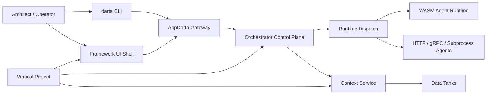

# Architecture

AppDarta separates the central control plane from business-scoped vertical implementations.

## Control Plane

Framework-owned:

- CLI
- UI shell
- gateway
- orchestration and policy engine
- model registry and codegen controls
- runtime dispatch contract
- central schemas and validation

## Vertical Plane

Vertical-owned:

- use case and design instance specs
- business modules
- business runtime code
- business UI modules
- business data bindings

The framework remains centralized. Verticals stay business-scoped.
