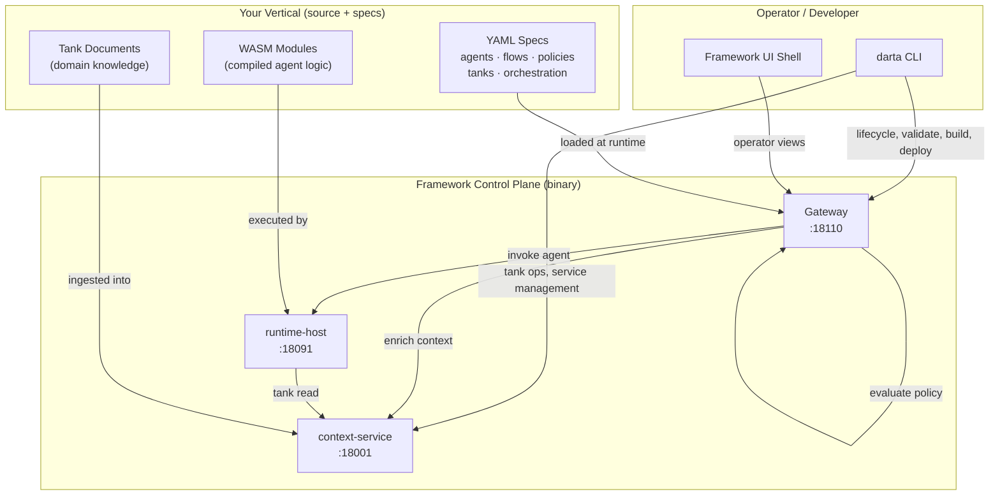
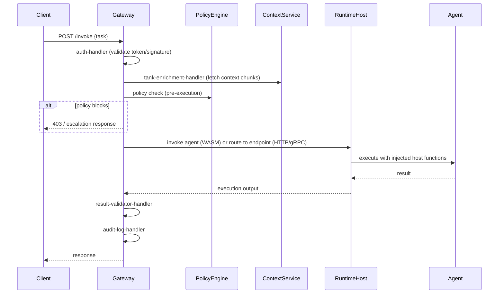
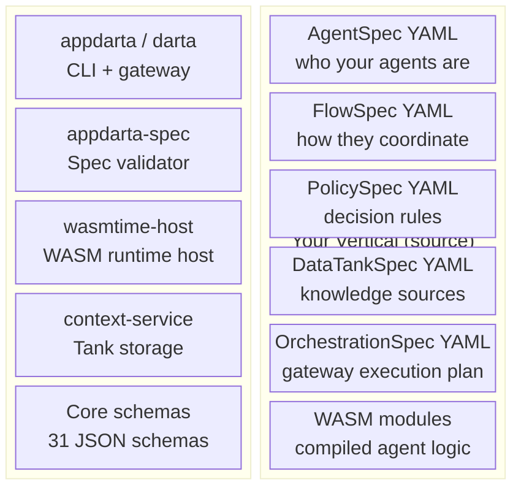
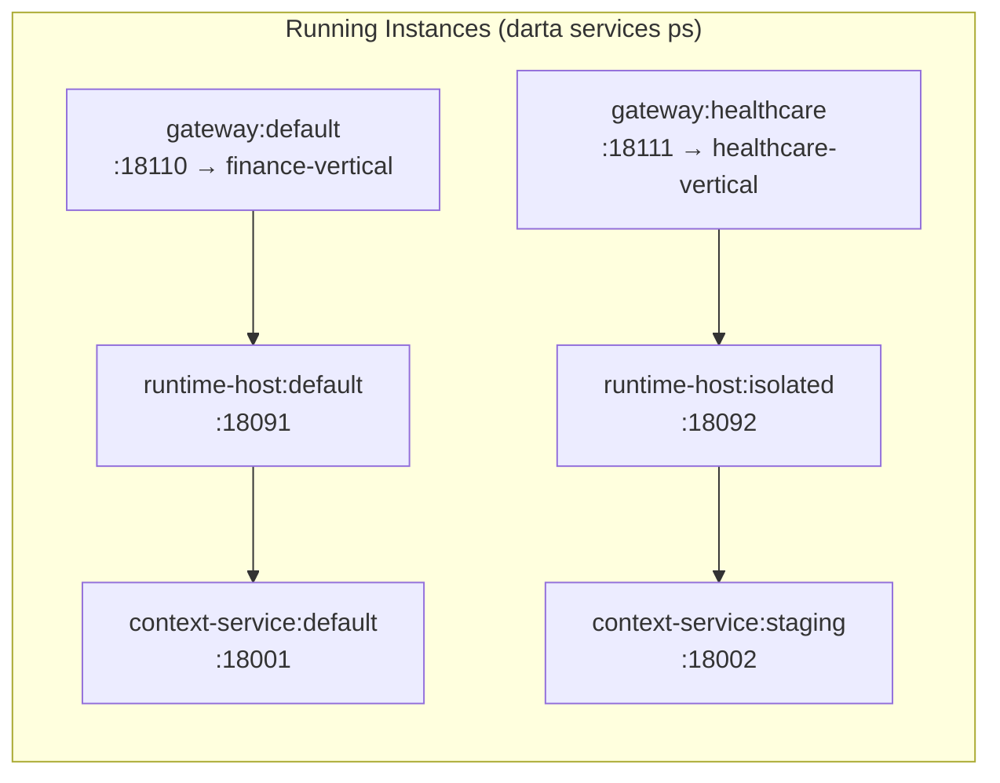
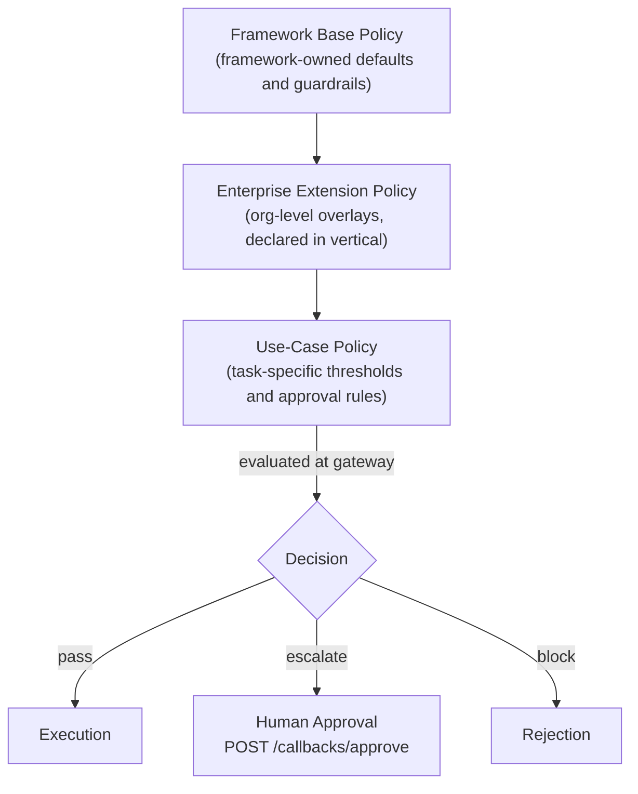
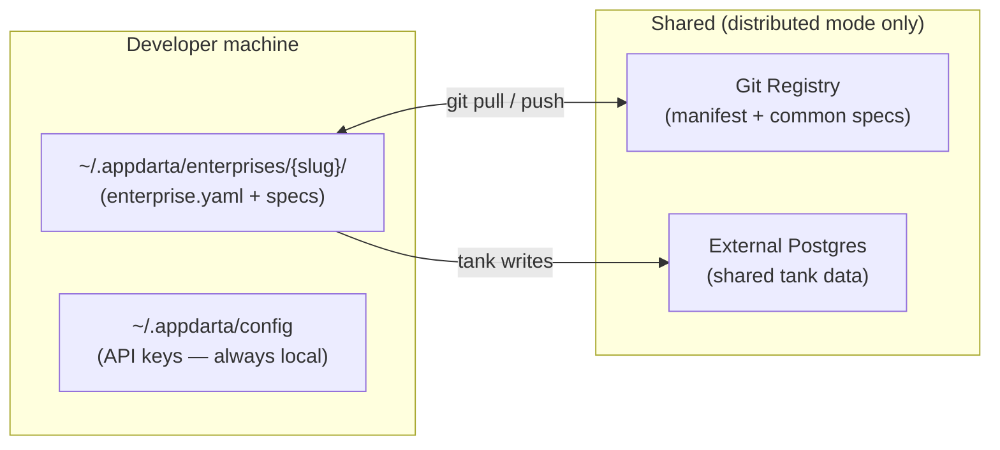
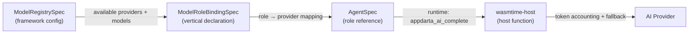

# Architecture

AppDarta separates the framework-owned control plane from vertical-owned domain logic. Your team never touches the control plane — you configure it through specs and CLI flags.

---

## System Overview



---

## Request Flow Through the Gateway

When a task is submitted to the gateway:



For async invocations, the gateway queues the task and returns an invocation ID immediately. The client polls `/invocations/{id}` or receives a callback.

---

## Component Ownership



The framework reads your vertical's specs and WASM at runtime. Nothing in your vertical is compiled into a framework binary.

---

## Multi-Instance Topology

Each framework service can run as multiple independent named instances. This supports staging environments, multi-tenancy, and load distribution without any framework changes.



Start additional instances with:

```bash
darta services start --service context-service --instance staging --port 18002
darta services start --service runtime-host --instance isolated --port 18092
darta gateway serve --listen 127.0.0.1:18111 --project ./healthcare-vertical
```

---

## Policy Model

AppDarta uses a layered policy model:



Your vertical writes `PolicySpec` files that contribute to the enterprise and use-case layers. The framework evaluates them at every gateway invocation. Framework-base policy is binary-owned and not overridable.

---

## Enterprise Registry

AppDarta supports both solo and team development through the enterprise registry.

| Mode | Manifest | Tank data |
|---|---|---|
| Local (default) | `~/.appdarta/enterprises/{slug}/` on each machine | local-embedded or local-dockerized |
| Distributed | same path, but is a git working tree | external Postgres (shared DSN) |

In distributed mode, the enterprise directory is a git working tree linked to a shared registry remote. `darta enterprise sync` pulls the latest manifest. `darta enterprise onboard` lets a new team member clone the registry and any registered project repos in one step.

API keys always remain local in `~/.appdarta/config` regardless of mode.



---

## AI Governance Model



Vertical developers declare which business phases need AI and which framework role to use. The framework handles provider resolution, fallback chains, token accounting, and cost visibility. Provider SDK calls never appear in vertical business code.
