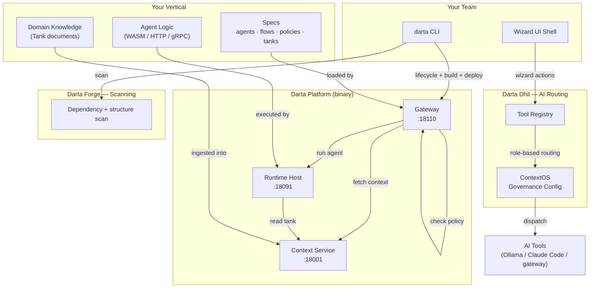
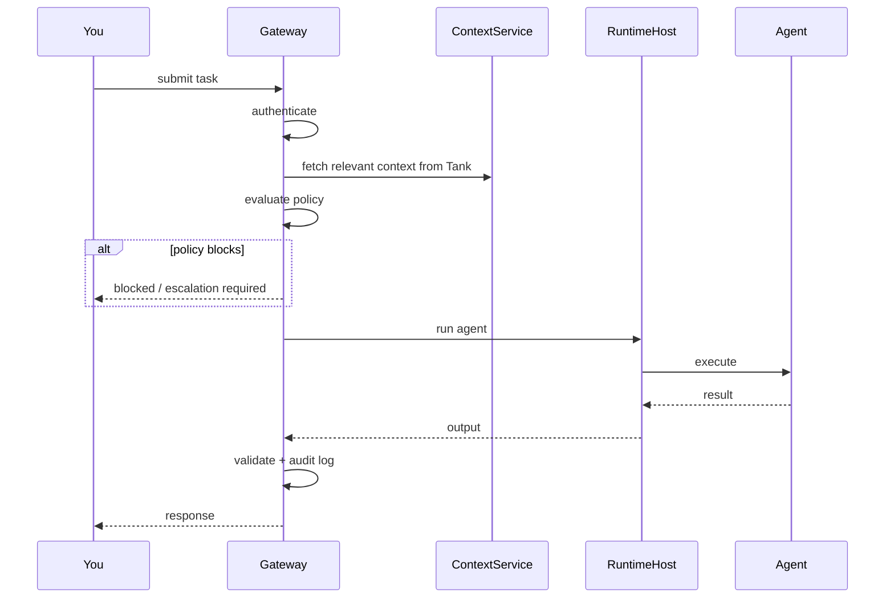
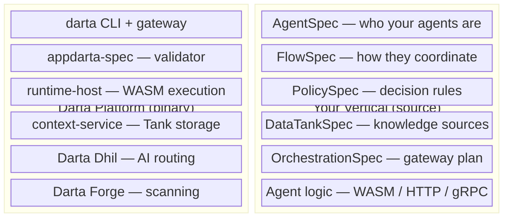
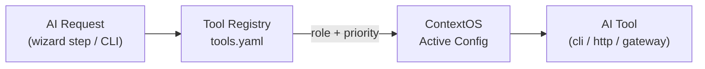
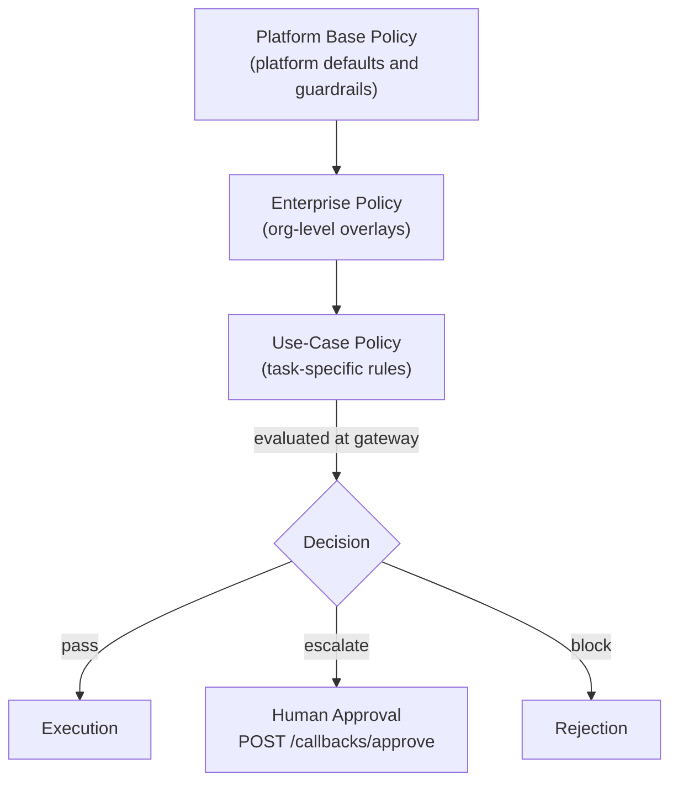
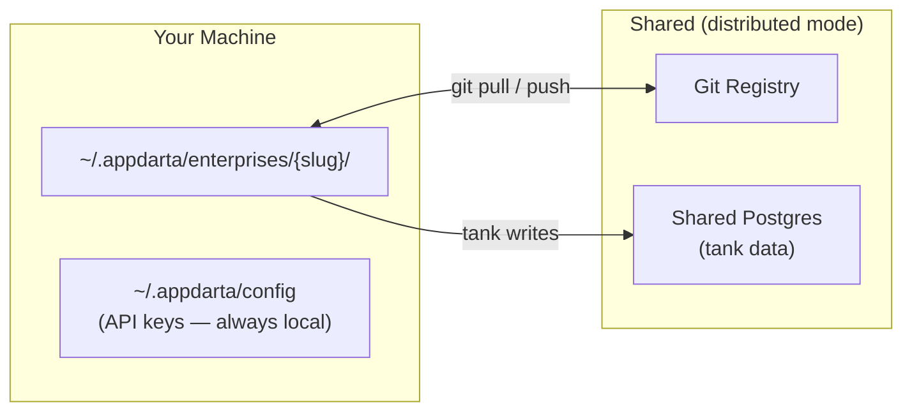
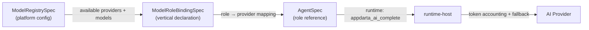

# Architecture

Darta Platform separates the platform-owned control plane from your domain code. You configure the platform through specs and the CLI — you never need to touch what runs underneath.

---

## The Big Picture

---

## How a Request Flows

When a task reaches the gateway:

Async tasks get an ID immediately. You poll for the result or receive a callback.

---

## What the Platform Owns vs What You Own

The platform reads your vertical's specs and agent logic at runtime. Nothing in your vertical is compiled into a platform binary.

---

## Darta Dhil — AI Routing Layer

Every AI action in the wizard UI and CLI goes through Dhil. Dhil routes the prompt to the right tool based on the role of the task, the tools you have registered, and the active ContextOS config.

### Two-level flow

The wizard runs AI in two levels:

1. **Local** — fast local model (e.g. Ollama) generates a first draft.
2. **Enhance with Dhil** — sends the draft to the higher-priority tool for a refined result.

This keeps the UI responsive while giving you full AI quality when you need it.

### ContextOS

ContextOS stores named AI governance configs. Each config maps task roles to specific tools and models. Activate a different config per project or environment — no spec changes needed.

---

## Darta Forge — Scanning Layer

Forge scans your vertical project for dependency issues, structural drift, and quality signals.

Currently: dependency organisation and scan results in the CLI.
Coming: scan results surfaced in the wizard UI, and Forge checks as part of the deploy gate.

---

## Policy Model

Your vertical writes `PolicySpec` files for the enterprise and use-case layers. The platform evaluates them at every gateway invocation. Base policy is platform-owned and not overridable.

---

## Enterprise Registry

Darta supports both solo and team development through the enterprise registry.

| Mode | Manifest | Tank data |
|---|---|---|
| Local (default) | `~/.appdarta/enterprises/{slug}/` | local embedded or local Docker |
| Distributed | same path, synced via git | external Postgres (shared DSN) |

In distributed mode, `darta enterprise sync` pulls the latest manifest. `darta enterprise onboard` lets a new team member set up in one step.

---

## AI Governance

Your vertical declares which business phases need AI and which platform role to use. The platform handles provider resolution, fallback chains, token accounting, and cost visibility.

See [ai-governance.md](docs/ai-governance.md) for full details.
