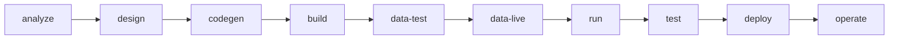

# Lifecycle

AppDarta verticals move through signed and inspectable stages.



## Root lifecycle specs

- `UseCaseSpec`
- `UseCaseClarificationReport`
- `SolutionDesignSpec`

These stay at project root and are signed off before build-time slices are materialized.

Record approvals explicitly:

- `darta project signoff --project . --stage usecase --name <approver>`
- `darta project signoff --project . --stage clarification --name <approver>`
- `darta project signoff --project . --stage design --name <approver>`

## Standard stage outputs

Analyze should hand design a small business package:

- `specs/analysis/<domain>-usecase.yaml`
- `specs/analysis/<domain>-clarification-report.yaml`
- `specs/analysis/<domain>-usecase-diagram.swim`
- `specs/analysis/<domain>-analysis-handoff.md`

Design should hand build/codegen a small technical package:

- `specs/design/<domain>-solution-design.yaml`
- `specs/design/<domain>-technical-sequence.swim`
- `specs/design/<domain>-design-handoff.md`

Build and test should hand runtime and deploy a small execution package:

- `specs/codegen/executions/<task-id>.build-handoff.md`
- `demo/artifacts/<name>-runtime-handoff.md`
- `demo/artifacts/<name>-verification-brief.md`

Practical rule:

- business side: one Swimlanes interaction diagram is enough
- technical side: one Swimlanes sequence diagram for the primary runtime path is enough for v1

## Build-time slices

Design decides:

- project modules
- commons
- tanks
- policies
- orchestration
- UI/runtime assets

Build implements them.

## Practical stage flow

1. Inspect the current state:
   - `darta project inspect --file .`
   - `darta analyze inspect --project .`
   - `darta design inspect --project .`
   - `darta design compare --project .`
2. Record the required stage approvals:
   - use case
   - clarification
   - design
3. Generate implementation work:
   - `darta codegen plan --project .`
   - `darta codegen prepare --project . --task <task-id>`
   - `darta codegen review --project . --task <task-id>`
   - `darta codegen apply --project . --task <task-id>`
4. Progress through runtime delivery:
   - `darta build project --project .`
   - `darta test project --project .`
   - `darta run project --project .`
   - `darta deploy plan --project .`

## What each later stage reads

- `build` reads the signed design package plus codegen build handoffs
- `test` reads the prepared bundle and emits a verification brief for the smoke path
- `run` reads the prepared bundle and runtime handoff
- `deploy` reads the runtime handoff, verification brief, shared asset topology, and lifecycle readiness

---

## UI-driven lifecycle

All stages are also accessible through the wizard UI:

```bash
darta ui serve
```

The wizard opens a browser shell with interactive panels for each stage (Setup, Use Cases, Clarify, Design, Build, Deploy). Sign-offs recorded in the UI are written to the same YAML files as the CLI.

A persistent file explorer sidebar shows the project tree (read-only, IDE-style) and highlights spec files referenced by the active panel.

The **Design panel** provides four capabilities beyond the CLI inspect command:

- **AI self-assessment** — shows which enterprise agents and tanks can be reused, with status chips (bound / missing / stale) and click-to-highlight file refs
- **Sequence diagram generation** — generates SVG sequence diagrams per key flow, saved as `specs/design/{domain}-technical-sequence.swim`
- **Build prompts** — LLM-generated per-component build instructions saved to `specs/design/{component}-build-prompt.md`
- **Review notes** — a persistent design review log written to `specs/design/{domain}-design-review-notes.yaml`; sign-off is gated on review notes existing

The **Clarify panel** supports use case linking — attaching this project's use cases to use cases in other enterprise projects to make cross-project dependencies explicit before diagram generation is allowed.
