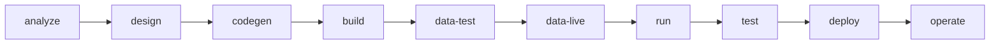

# Lifecycle

AppDarta verticals move through signed and inspectable stages.

## Root lifecycle specs

- `UseCaseSpec`
- `UseCaseClarificationReport`
- `SolutionDesignSpec`

These stay at project root and are signed off before build-time slices are materialized.

## Build-time slices

Design decides:

- project modules
- commons
- tanks
- policies
- orchestration
- UI/runtime assets

Build implements them.
